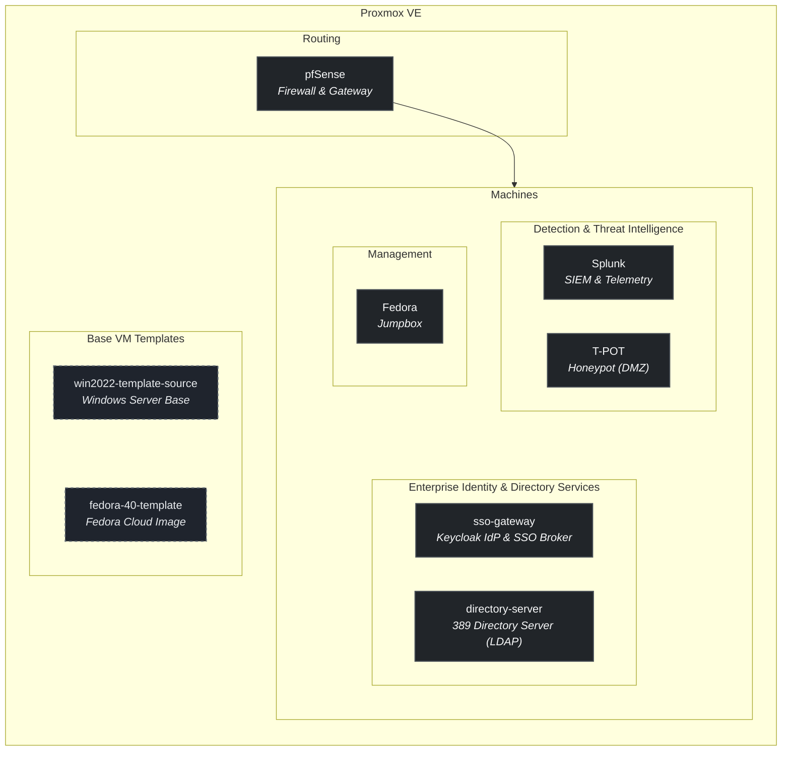

Computer Science undergraduate at the University of Central Florida focused on security engineering, enterprise identity, and infrastructure automation.

---

### 🖥️ Home Lab Infrastructure

```mermaid
flowchart TB
    subgraph PVE["Proxmox VE"]
        direction TB

        subgraph Core["Routing"]
            pfSense["pfSense<br/><i>Firewall & Gateway</i>"]
        end

        subgraph Workloads["Machines"]
            direction TB

            subgraph Management["Management"]
                direction TB
                Fedora["Fedora<br/><i>Jumpbox</i>"]
            end

            subgraph Security["Detection & Threat Intelligence"]
                direction LR
                Splunk["Splunk<br/><i>SIEM & Telemetry</i>"]
                TPOT["T-POT<br/><i>Honeypot (DMZ)</i>"]
            end

            subgraph IAM["Enterprise Identity & Directory Services"]
                direction LR
                SSO["sso-gateway<br/><i>Keycloak IdP & SSO Broker</i>"]
                DirectoryServer["directory-server<br/><i>389 Directory Server (LDAP)</i>"]
            end

            %% Force 2 vertical tiers: Management and Security side-by-side, IAM below
            Management ~~~ IAM
            Security ~~~ IAM
        end

        subgraph Automation["Base VM Templates"]
            direction TB
            WinTemplate["win2022-template-source<br/><i>Windows Server Base</i>"]
            FedoraTemplate["fedora-40-template<br/><i>Fedora Cloud Image</i>"]

            %% Force vertical stacking inside templates
            WinTemplate ~~~ FedoraTemplate
        end
    end

    %% Network Routing (Left only)
    pfSense --> Workloads

    %% Invisible alignment constraint to lock the two-column grid
    pfSense ~~~ Automation

    classDef vm fill:#212529,stroke:#495057,stroke-width:1.5px,color:#f8f9fa;
    classDef template fill:#1f242d,stroke:#6c757d,stroke-width:1.5px,stroke-dasharray: 4 4,color:#e9ecef;

    class pfSense,Fedora,SSO,DirectoryServer,Splunk,TPOT vm;
    class WinTemplate,FedoraTemplate template;
```
